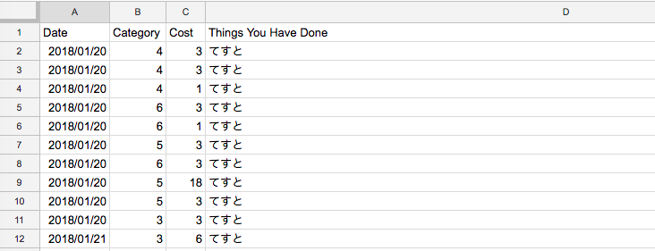
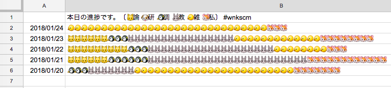

# 進捗マクロ

技術を磨くぞ！論文を書くぞ！と思っても、日々のモチベーションを保ちつづけるのは、
(少なくとも私には) 簡単なことではありません。
千里の道も一歩から。毎日の進捗を振り返ることによって一握りの充足感を日々与え、
意思の弱い私の背中をそっと押してくれる存在が欲しい…
そうした次第で、日々の進捗を簡単に見える化してくれるマクロを書きました。
Googleスプレッドシート上に日々の進捗を記録し、これを集計してカテゴリごとの進捗量を表示するJavaScriptマクロです。
プログラムをスプレッドシートのマクロとして登録すれば、
スプレッドシート上でメニューをクリックすることにより実行することができます。

サンプルファイル (閲覧のみ可能) をこちらにご用意しています:
[https://goo.gl/oVDrr2](https://goo.gl/oVDrr2)

## 準備

まず、スプレッドシートで "Record" および "Graph" という名前の2つのシートを用意して下さい。
そして、スプレッドシートのメニューから "ツール" -> "スクリプトエディタ..." を選択し、
このレポジトリの "ShinchokuMacro.js" をそのままコピーして下さい。
なお、初めてマクロを実行する場合には、警告が表示され、実行の許可を行う必要があります
(もしバグがあって問題が起きたとしても、私は責任をとれませんので自己責任でお願いします)。

## 使い方

まず、"Record"シートに、以下のように日々の進捗を記録します。1列目は日付 (**注意**: データの表示形式を「日付」に設定して下さい。
メニューの"表示形式" -> "数字" -> "日付")、2列目はタスクのカテゴリ番号 (1以上)、3列目はタスクにかけたコスト (例えば所用時間など)、4列目はタスクの内容に関するメモ (任意) です。



そして、スプレッドシートのメニューから "進捗マクロ" -> "進捗をグラフ化" を選択すれば、
以下のように、"Graph" シート上で進捗が簡単に見える化されます。



ここで各カテゴリを表す文字は、"ShinchokuMacro.js" の14行目の "category" という配列で指定していますので、
こちらを書き換えてカスタマイズして下さい。

```JavaScript
var category = ['🐱','🐶','🐧','🐰','🐤','🐹']; // バー表示に使う文字の配列
```

では、皆さまが進捗とともにあらんことを！
